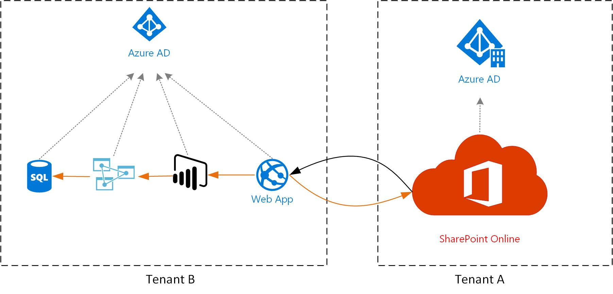

# Introduction
This sample demonstrates how to embed a PowerBi report that is created and maintained by Tenant B into SharePoint Online environment managed by Tenant A. Disclaimer: the current solution is based on a real-world scenario, but it is not the only way to achieve this goal. Some of the design decisions taken here will be influenced by customer-specific reasoning.

This sample is applicable for the following situation: 
- **Tenant A** owns and controls: 
    - SharePoint Online
    - Authentication of end users
- **Tenant B** owns and controls: 
    - PowerBI report
    - Underlying data set, exposed via Analysis Services
    - Authorization of end users

SharePoint Online offers an OOTB web part, which supports the integration and security model if all elements are controlled by the same tenant. In this setup, that model doesn't quite provide the requested level of isolation / separation of responsibilities.

# Approach
Instead of using the out of the box web part, we can design a solution based on the SharePoint Provider-hosted app model and PowerBI Embedded: 

In this setup, ownership between Tenant A and Tenant B is defined as follows: 
- The SharePoint Online environment belongs to Tenant A. 
- PowerBI, PowerBI Embedded, Web App, Analysis Services and any data belongs to Tenant B. 
- Users from Tenant B have been invited to Tenant A via B2B
- Potential users from other Tenants have been invited to Tenant A via B2B
 
In this approach, the individual components have the following responsiblities:
- _A Custom Web Application_ acts as a mediator between the SharePoint Online environment and the PowerBI report. It performs any required data enhancement / identity transformations or authorization logic. 
- This custom web application is registered as _a Provider Hosted App_ in SharePoint Online. By registering the application, it obtains a client id / secret, allowing it to securely query SharePoint Online to obtain the identity of the active user, associated groups and other contextual information. 
- _PowerBI_ is used to visualize reports. PowerBI Embedded is being used to provide report processing capacity. 
- _Azure Analysis Services_ is used to expose and control access to data. Multiple models can be created in AAS, depending on reporting needs.

# User identity flow
In this approach, the user identity flow / and authorization flow is as follows:
- A user logs into the SharePoint Online environment. They are authenticated against Tenant A's Azure AD and authorized via the groups in SharePoint Online. 
- A user can navigate to a page that launches the Provider-hosted web part. This request to the custom web application ish andled as follows: 
  - Web Application validate that the incoming request is initiated from the SharePoint online context
  - Web Application attempts to get the SharePoint user context and group membership
  - Custom logic can be performed to determine appropriate user roles
  - Web Application will connect to PowerBI to receive information on the workspace, report and underlying data set. This information includes details on whether an _Effective Identity_ is required. 
  - Web Application will generate an access token for PowerBI, with the following details: 
    - The username is the Service Principal Object Id (the Azure ID identity of the web application, not the user)
    - Roles is kept empty
    - CustomData is populated with the user's email address in the sample. This information is used in Analysis Services for security trimming / filtering the availalble data. 
  - Web Application will  generate a custom HTML page, which will use the token to obtain and display the report. 

# Deployment guidance
It is assumed that the SharePoint Online environment is already available / configured correctly. 

To implement the scenario, follow the steps as listed in the [Deploy.sh](/Script/deploy.sh) script.

# Known challenges
In our testing, we experienced the following:
-	OAuth tokens take some time to expire. As processes keep these tokens alive for some time, your testing should include some time for changes to replicate / tokens to expire and be refreshed. Plan for a short break / some coffee, if the configuration should be right but does not work as expected.  
-	Occasionally, it helps to restart Analysis Services / PowerBI to shorten the wait. 

# Relevant links
https://docs.microsoft.com/en-us/power-bi/service-create-the-new-workspaces 
https://docs.microsoft.com/en-us/power-bi/developer/embed-service-principal 

https://docs.microsoft.com/en-us/sharepoint/dev/sp-add-ins/get-started-creating-provider-hosted-sharepoint-add-ins 
https://docs.microsoft.com/en-us/sharepoint/dev/sp-add-ins/register-sharepoint-add-ins 

https://github.com/Microsoft/PowerBI-Developer-Samples/tree/master/App%20Owns%20Data/  

https://docs.microsoft.com/en-us/power-bi/developer/embedded-row-level-security#working-with-analysis-services-live-connections 
https://docs.microsoft.com/en-us/power-bi/developer/embedded-row-level-security#using-the-customdata-feature
